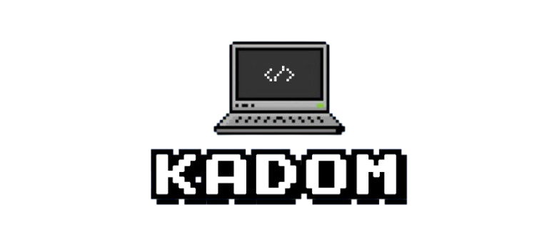

## 💻 Quem sou eu?
Olá! Meu nome é Kauã Vicente Domingos, entusiasta de tecnologia e automação. Estou explorando o mundo da programação... Gosto de encontrar formas criativas de facilitar tarefas repetitivas com código. Embora eu ainda esteja no começo da minha jornada como desenvolvedor, cada projeto é uma oportunidade para aprender algo novo e evoluir.

## 🚀 Habilidades e Tecnologias
- Python: Desenvolvimento de scripts e automação.
- Selenium: Automação de processos web.
- Manipulação de Dados: Uso de Pandas e OpenPyXL para trabalhar com arquivos CSV e Excel.
- HTML/CSS/PHP: Criação e manutenção de aplicações web.
- Infraestrutura: Experiência com VMs e servidores (Hetzner).
- Versionamento: Controle de projetos com Git/GitHub.

## 🎯 O que estou aprendendo atualmente
Automação avançada com Python e Selenium.
Melhoria de processos com bots e web scraping.
Boas práticas de desenvolvimento e organização de projetos.
Aprimoramento de UX/UI para desenvolvimento web

## 🎲 Curiosidades sobre mim
- Gosto de resolver quebra-cabeças: Automação é como resolver um quebra-cabeça real, e eu adoro isso.
- Fascinado por produtividade: Qualquer dica ou ferramenta que economize tempo sempre chama minha atenção.
- Autodidata: Tenho preferência por aprender sozinho com tutoriais e documentações.
- Apreciador de música: Gosto de trabalhar ouvindo música ou podcast.
- Primeiro contato com servidores: Aprender a configurar uma VM na Hetzner foi uma das minhas conquistas recentes.
- Erro favorito: "404 Not Found" – Quando você enlouquece porque o arquivo não carrega e percebe que errou uma letra no caminho.😅

## 📫 Como entrar em contato
- E-mail: kadom.dev@outlook.com
- LinkedIn: www.linkedin.com/in/kauavic676
- Portfólio: só clicar na imagem!😉

  

  
  
  
  
  
  
  
  
  
  
  

###

  
  

###

